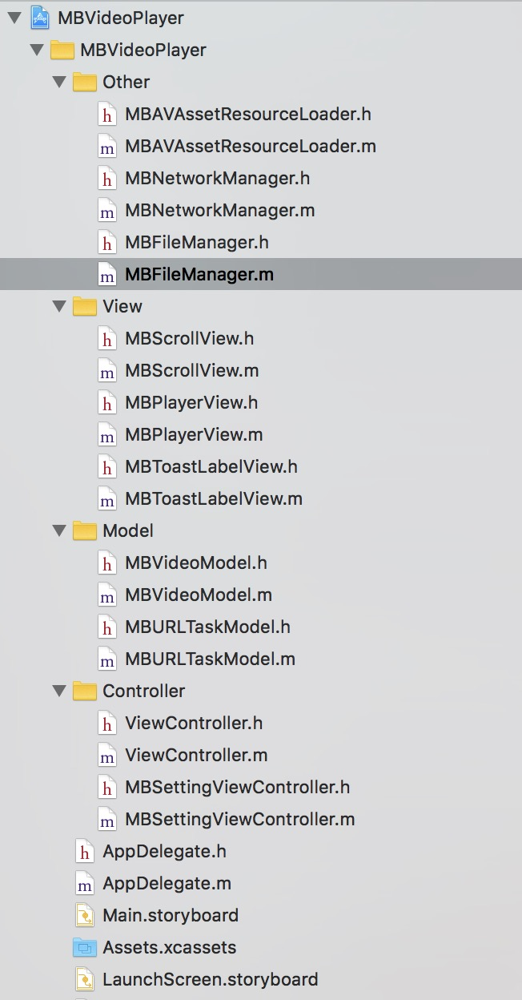
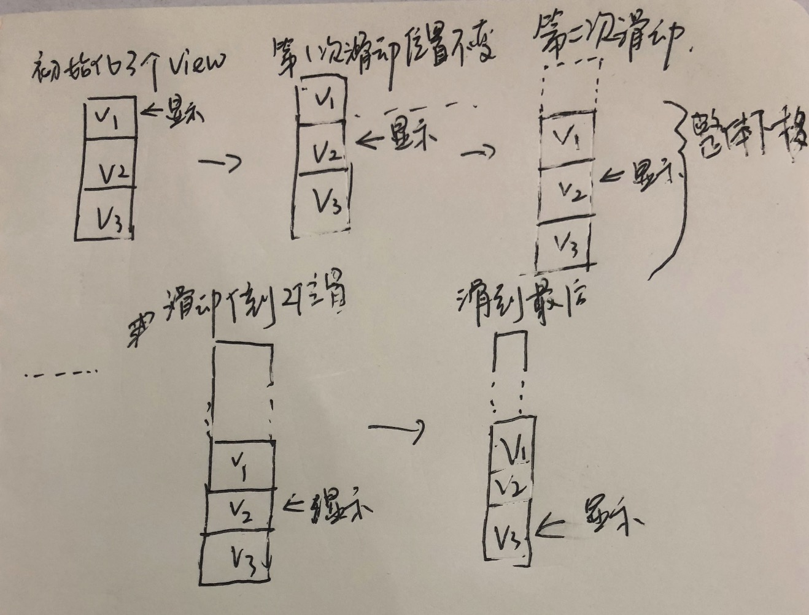
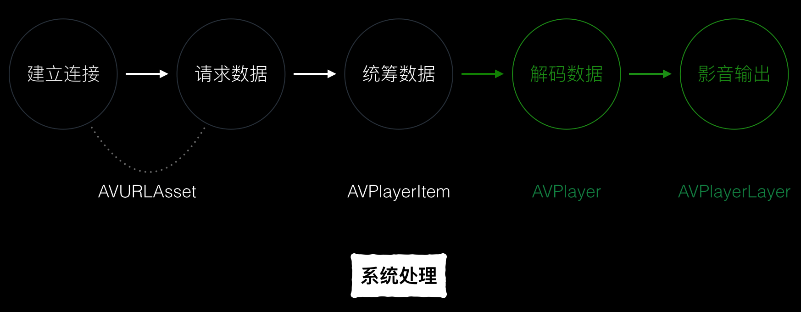
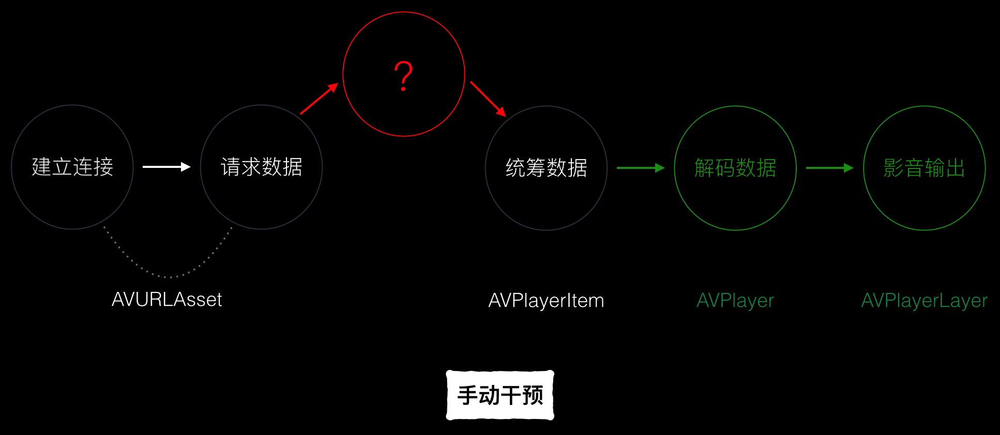

## Feed流在线播放器设计
### 一. 文档大纲
- 效果预览
- 功能说明
- 工程说明
- 无限滑动技术实现
- 边播边下载技术实现
- 参考资料

### 二. 效果预览

工程效果预览如下图所示


### 三. 功能说明

工程实现了三方面的功能

- 基于UIScrollView的无限滑动功能
> 在下拉过程中，到底部的时候，加载新的数据，若数据无限，则页面可以无限滑动下去。

- 在线视频的边播放边下载功能
> 视频播放过程中，会自动下载到本地沙盒中。支持断点续传功能。

- 离线播放功能
> 如果本地存在播放的视频数据，则优先播放本地的数据，所以在离线状态下也可以进行视频播放。

### 四. 工程说明
工程结构如下所示：



说明如下：

 ```Objective-C

MBVideoPlayer
    └── Other
    │   ├── MBAVAssetResourceLoader (h/m)      #播放器数据代理类，用于拦截播放器请求并返回数据
    |   └── MBNetworkManager (h/m)             #网络访问类，用于向服务器请求播放数据
    ├── View 
    |   ├── MBScrollView (h/m)                 #ScrollerView类，用来显示PlayerView
    |   └── MBPlayerView (h/m)                 #视频播放视图
    |   └── MBToastLabelView (h/m)             #用于显示使用过程的提示
    ├── Model 
    |   ├── MBVideoModel (h/m)                 #videoModel类，包含了视频下载链接，视频描述等字段
    |   └── MBURLTaskModel (h/m)               #视频下载model，包含了当前下载进度，视频大小等信息   
    ├── Controller
        ├── ViewController (h/m)               #主VC，显示视频流
        |── MBSettingViewController (h/m)      #设置界面VC，用于清除缓存数据      
        
 ```

### 五. 无限滑动技术实现

使用`UIScrollView`实现无限滑动，基于具体的应用场景，有不同的实现方式。这里列举两种应用场景的使用方式。

1.显示的View的数目固定的情况下（这种方式不在本工程中）

   当显示View的数目固定的时候，其实UIScollView上面只需要添加三个View就能显示所有的View，无需为所有的View都添加一个独立的View。实现的原理如下：
   
   - 初始化scrollView的时候，设置3个View，添加到scrollView中，并通过设置contentoffset的属性，让中间的view显示到界面上。
   			
   - 每次滑动的时候，在`scrollViewDidScroll:`方法种，判断是否滑动的下一个View，如果滑动到下一个View的话，则继续设置scrollView的contentOffset，让scrollView复位，始终让中间那个View显示。
   - 复位ScrollView之后，设置3个View的位置，如果是UIImageView的话，其实直接修改它们的image的值就可以了。

   代码如下所示：
   
   ```objc
   - (void)scrollViewDidScroll:(UIScrollView *)scrollView {
    CGFloat offset = scrollView.contentOffset.y;
    if (self.lives.count) {
        if (offset >= 2*self.frame.size.height) //向下滑
        {
            // 对ScollView进行复位处理
            scrollView.contentOffset = CGPointMake(0, self.frame.size.height);
            _currentIndex++;
            self.upperImageView.image = self.middleImageView.image;
            self.middleImageView.image = self.downImageView.image;
            
            
            if (_currentIndex == self.lives.count - 1)//获取最后一张显示的是什么内容
            {
                _downLive = [self.lives firstObject];
            } else if (_currentIndex == self.lives.count)
            {
                _downLive = self.lives[1];
                _currentIndex = 0;
                
            } else
            {
                _downLive = self.lives[_currentIndex+1];
            }
            [self prepareForImageView:self.downImageView withLive:_downLive];
        }
        else if (offset <= 0) //向上滑
        {
            // slides to the upper player
            scrollView.contentOffset = CGPointMake(0, self.frame.size.height);
            _currentIndex--;
            self.downImageView.image = self.middleImageView.image;
            self.middleImageView.image = self.upperImageView.image;
            
            
            if (_currentIndex == 0)
            {
                _upperLive = [self.lives lastObject];
                
            } else if (_currentIndex == -1)
            {
                _upperLive = self.lives[self.lives.count - 2];
                _currentIndex = self.lives.count-1;
                
            } else
            {
                _upperLive = self.lives[_currentIndex - 1];
            }
            [self prepareForImageView:self.upperImageView withLive:_upperLive];
        }
    }
}
   
   ```
 
2.显示的view的数目不固定，通过上拉到底进行数据加载的场景

   当要显示的View的数目不固定的时候，使用上面那种方式对于数据加载时机的判断就会相对比较复杂，所以考虑使用一个比较简单的方式，第一种方式可以把UIScrollView想成一个闭环，3个View无限循环。为了实现上滑到底加载，我们可以考虑把这个闭环打开，还是3个View。但是3个view的整体位置，从滑动第二个view开始到倒数第二个view之间，相对位置不变，整体随着滑动向下滑。整体流程，如下草图所示：
   
   
   
   示例代码如下所示
   
   ```objc
   
   - (void)reveiveNewData:(NSArray *)data {
      ......
            
      if (data.count > 0) {//如果获取到新的数据，则自动上滑显示
            self.contentSize = CGSizeMake(self.frame.size.width, self.frame.size.height * self.dataArray.count);
            self.contentOffset = CGPointMake(0, self.frame.size.height * self.currentIndexOfImageView);
        }
      ......
   }
   
   - (void)scrollViewDidScroll:(UIScrollView *)scrollView {
    CGFloat offset_y = scrollView.contentOffset.y;
    
    CGPoint translatePoint = [scrollView.panGestureRecognizer translationInView:scrollView];
    if (self.dataArray.count == 0) {
        return;
    }
    
    if (offset_y > (self.frame.size.height * (self.dataArray.count - 1))) {
        if (self.isLoading) {
            return;
        }
        NSLog(@"拉到底部了");
        
        self.isLoading = YES;
        [self.dataDelegate pullNewData]; //如果拉到了底部，则去拉取新数据
        return;
    }

    if (self.currentIndexOfImageView > self.dataArray.count - 1) {
        return;
    }

    //向下滑动。
    if (offset_y > (self.frame.size.height * self.currentIndexOfImageView) && translatePoint.y < 0) {
        self.currentIndexOfImageView++;
        NSLog(@"lalalalalal");

        if (self.currentIndexOfImageView == self.dataArray.count) {
            return;
        }

        self.firstImageView.frame = self.secondImageView.frame;
        self.firstImageView.image = self.secondImageView.image;
        self.secondImageView.frame = self.thirdImageView.frame;
        self.firstImageView.image = self.secondImageView.image;
        self.secondImageView.image = self.thirdImageView.image;

        CGRect frame = self.thirdImageView.frame;
        frame.origin.y += self.frame.size.height;
        self.thirdImageView.frame = frame;
        self.thirdVideoModel = [self.dataArray objectAtIndex:self.currentIndexOfImageView];
        [self.thirdImageView sd_setImageWithURL:self.thirdVideoModel.imageURL];
    }
    
    if (offset_y < 0) {
        NSLog(@"已经到顶部了");
        return;
    }
    
    //向上滑动
    if (translatePoint.y > 0 && offset_y < self.secondImageView.frame.origin.y) {
        if (self.currentIndexOfImageView >= 3) {
            self.thirdImageView.frame = self.secondImageView.frame;
            self.thirdImageView.image = self.secondImageView.image;
            self.secondImageView.frame = self.firstImageView.frame;
            self.secondImageView.image = self.firstImageView.image;
            
            CGRect frame = self.firstImageView.frame;
            frame.origin.y -= self.frame.size.height;
            self.firstImageView.frame = frame;
            self.firstVideoModel = [self.dataArray objectAtIndex:self.currentIndexOfImageView - IMAGEVIEW_COUNT];
            [self.firstImageView sd_setImageWithURL:self.firstVideoModel.imageURL];
            
            self.currentIndexOfImageView--;
        }
    }
}
   
   ```

### 六. 边播边下载技术实现

工程中使用`AVPlayer`来实现视频的播放，在视频播放过程中，会经历如下过程：

   
   
这些过程都是系统的类帮我们完成的。如果我们要实现边下边播，就需要在数据请求的过程中，设置一个代理，截取请求，然后转发，收到服务器数据返回后，代理保存数据到本地，然后再把数据返回到播放器那边，如下所示：

   
   
而`AVURLAsset`中的`AVAssetResourceLoader`就是负责数据加载的，我们只要遵守它的`AVAssetResourceLoaderDelegate `协议，就能设置一个代理。`AVURLAsset`加载数据的时候，都会调用到协议`shouldWaitForLoadingOfRequestedResource`方法，我们通过这个方法取获取到请求，并转发到网络访问模块。具体流程可以分为以下步骤：

 1.修改视频的URL的scheme为系统无法识别的scheme，这样`AVURLAsset`发出的请求才会跑到我们的代理。
  
  ```objc
  - (NSURL *)getSchemeVideoURL:(NSURL *)url
{
    NSURLComponents *components = [[NSURLComponents alloc] initWithURL:url resolvingAgainstBaseURL:NO];
    components.scheme = @"streaming";
    return [components URL];
}
  
  ```
  
 2.设置我们的代理。

  ```objc
  [urlAsset.resourceLoader setDelegate:self.resourceLoader queue:dispatch_get_main_queue()];

  ```

 3.转发请求

  ```objc
  - (BOOL)resourceLoader:(AVAssetResourceLoader *)resourceLoader shouldWaitForLoadingOfRequestedResource:(AVAssetResourceLoadingRequest *)loadingRequest {
    NSLog(@"dk----%@", loadingRequest);
    [self.loadingRequests addObject:loadingRequest];
    [self dealLoadingRequest:loadingRequest];
    
    return YES;
}

  ```
  
 4.把请求返回给播放器
 
  ```objc
  
  - (BOOL)respondWithDataForRequest:(AVAssetResourceLoadingDataRequest *)dataRequest {
    long long startOffset = dataRequest.requestedOffset;
    ......
    
    [dataRequest respondWithData:[filedata subdataWithRange:NSMakeRange((NSUInteger)startOffset, (NSUInteger)numberOfBytesToRespondWith)]]; //把本地存在的数据返回到播放器
    
    ....
   }
  ```
### 七. 参考资料

 - [https://www.jianshu.com/p/0d4588a7540f](https://www.jianshu.com/p/0d4588a7540f)
 - [https://github.com/doubleYang1020/DYVideoListPlayV2](https://github.com/doubleYang1020/DYVideoListPlayV2)
